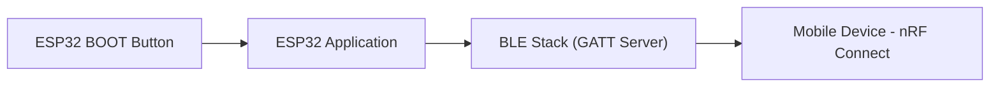
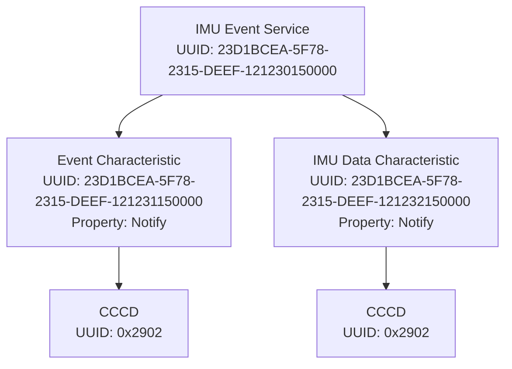

# ESP32 BLE IMU Event Streaming

## Overview

This project implements a **Bluetooth Low Energy (BLE) peripheral on ESP32** with a custom **GATT IMU Event Service** designed for wearable motion event detection.

The ESP32 acts as a **GATT server** and sends event metadata and corresponding IMU data to a smartphone using **BLE notifications**.

Since the real IMU and event detection algorithm are not integrated yet, a **button press on the ESP32** is used to simulate events.

When the button is pressed:

1. A random **event type** is generated
2. An **event metadata packet** is sent
3. **2 seconds of dummy IMU data** are streamed as multiple BLE notification packets

The system is tested using the **nRF Connect mobile application**.

---

# Objective

Implement a BLE peripheral with a custom **GATT sensor service** for IMU wearable event detection.

The service must support:

### Event Notification Characteristic
• Notify property  
• Payload:
- Event Type (1 byte)
- Timestamp (4 bytes)
- Confidence Score (1 byte)

Sent **once per event**.

### IMU Data Transfer Characteristic
• Notify property  
• Payload: **2 seconds of raw IMU data**

Data size calculation:

```
200 Hz × 12 bytes × 2 seconds = 4800 bytes
```

Data is transmitted as a sequence of BLE notifications.

Each packet contains a **sequence number** to allow reassembly.

---

# Features

• Custom **128-bit BLE Service UUID**  
• Two **BLE Notify characteristics**  
• Event metadata transmission  
• Chunked IMU data streaming  
• Sequence numbers for packet reassembly  
• MTU negotiation up to **247 bytes**  
• Button-triggered dummy events  

---

# Hardware Requirements

• ESP32 Development Board  
• Smartphone with **nRF Connect App**

---

# Development Environment

• ESP-IDF / PlatformIO  
• Visual Studio Code  
• nRF Connect (Mobile App)  
• GitHub

---

# System Architecture



---

# BLE GATT Service Design

### Custom Service UUID

```
23D1BCEA-5F78-2315-DEEF-121230150000
```

### Characteristics

| Attribute | UUID | Properties | Description |
|-----------|------|------------|-------------|
| Service | 23D1BCEA-5F78-2315-DEEF-121230150000 | — | Custom IMU Event Service |
| Event Characteristic | 23D1BCEA-5F78-2315-DEEF-121231150000 | Notify | Motion event metadata |
| Event CCCD | 0x2902 | Read / Write | Enables notifications |
| IMU Data Characteristic | 23D1BCEA-5F78-2315-DEEF-121232150000 | Notify | IMU data packets |
| IMU CCCD | 0x2902 | Read / Write | Enables notifications |

---

# GATT Attribute Hierarchy



---

# Event Types Supported

| Event | Code |
|------|------|
| Lift | 0x01 |
| Tilt | 0x02 |
| Rotate | 0x03 |
| Shake | 0x04 |
| Tap | 0x05 |
| Double Tap | 0x06 |
| Freefall | 0x07 |

A **random event type** is generated when the button is pressed.

---

# Data Packet Format

## Event Metadata Packet

Total size = **6 bytes**

| Byte | Field |
|-----|------|
| 0 | Event Type |
| 1-4 | Timestamp (ms) |
| 5 | Confidence Score |

Example:

```
Event Type = 0x04 (Shake)
Timestamp = device uptime in milliseconds
Confidence = 90
```

---

# IMU Data Transfer

IMU payload size:

```
200 Hz × 12 bytes × 2 seconds = 4800 bytes
```

BLE notification payload:

```
ATT payload = 244 bytes
Sequence number = 2 bytes
IMU data chunk = 242 bytes
```

### Packet Structure

| Field | Size |
|------|------|
| Sequence Number | 2 bytes |
| IMU Data Chunk | up to 242 bytes |

Total packets required:

```
4800 / 242 ≈ 20 packets
```

---

# Dummy IMU Data

Real sensor data is not yet used.

The firmware generates deterministic dummy data:

```c
dummy_imu_data[i] = (uint8_t)(i & 0xFF);
```

This allows testing BLE throughput and packet streaming.

---

# MTU Negotiation

The firmware sets the local MTU to **247 bytes**:

```c
esp_ble_gatt_set_local_mtu(247);
```

The mobile application must also request **MTU = 247**.

---

# Firmware Workflow

1. ESP32 starts BLE advertising
2. Smartphone scans and connects
3. User enables notifications
4. User requests MTU 247
5. User presses ESP32 **BOOT button**
6. ESP32:
   - Generates random event
   - Sends event notification
   - Streams IMU packets

---

# Testing Procedure

1. Flash firmware to ESP32
2. Open **nRF Connect**
3. Scan for device:

```
ESP32_IMU_EVENT_V2
```

4. Connect to the device
5. Request **MTU = 247**
6. Enable notifications for:
   - Event Characteristic
   - IMU Characteristic
7. Press the **BOOT button**

---

# Expected Result

After pressing the button:

• One **event metadata notification** is received  
• Approximately **20 IMU packets** are streamed  
• Each packet contains a **sequence number** and IMU data

---

# Example Serial Output

```
Connected
Negotiated MTU = 247
Event notify enabled
IMU notify enabled

Button pressed -> generating event 0x04

Event sent: type=0x04 timestamp=123456 confidence=90

Sending 20 IMU packets
IMU packet 1/20 sent
IMU packet 2/20 sent
...
IMU packet 20/20 sent
```

---
